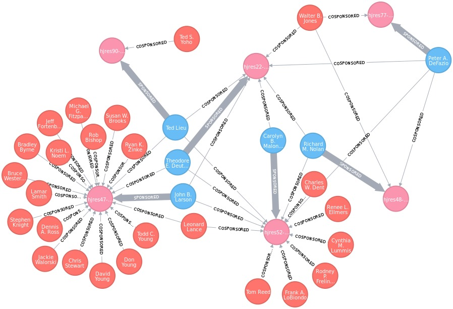
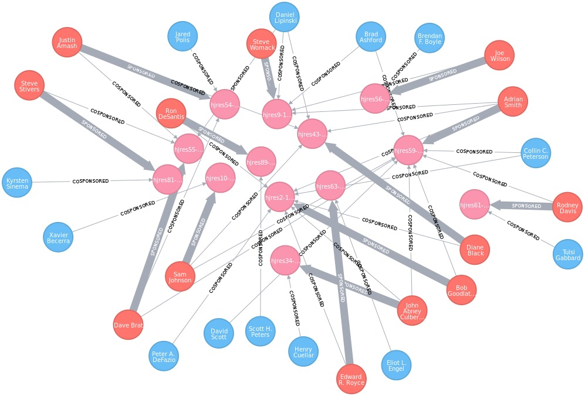

# Summary

Playing with graph databases and government data.  Below is an example graph
showing bills that were sponsored by democrats and co-sponsored by republicans.
Below that is the inverse (bills sponsored by republicans and co-sponsored by
democrats)

 

 

# Prerequisites
---------------
This package was tested with,
  - Ubuntu 14.04.4 LTS 64 bit
  - Python 3.5.1 from Anaconda 4.0.0

Prerequisites are
  - JDK version 8
  - Neo4j community edition 3.0.3

### JDK version 8

Neo4j 3 requires the Java Development Kit version 8 but this is not packaged with Ubuntu 14.04. However it is available through a PPA.  If it is not installed on
your system you can install it with the script,

```bash
> sudo ./install_openjdk_8.sh
```

If there is another version of the JDK on your system the script will ask you to
choose the default using a dialog similar to the one below,

    There are 2 choices for the alternative java (providing /usr/bin/java).

     Selection    Path                                            Priority   Status
    ------------------------------------------------------------
    * 0            /usr/lib/jvm/java-7-openjdk-amd64/jre/bin/java   1071      auto mode
    1            /usr/lib/jvm/java-7-openjdk-amd64/jre/bin/java   1071      manual mode
    2            /usr/lib/jvm/java-8-openjdk-amd64/jre/bin/java   1069      manual mode

To confirm that you are using the correct version of the JDK you can run,
```bash
> java -version
```

### Neo4j

After JDK is installed you can use the included script to install neo4j,
```bash
> sudo ./install_neo4j.sh
```

By default the neo4j server is available at `http://localhost:7474`.  It also has authentication
enabled by default (meaning you need to sign in with the default username and passoword, both
of which are `neo4j`).  This can be disabled by editing the `neo4j.conf` file.  On my Ubuntu
system (and using the install script included in this repo) the file was located at
`/etc/neo4j/neo4j.conf`.  To turn off authentication simply uncomment the line,

    # dbms.security.ha_status_auth_enabled=false


# Install
---------

With the prerequisites installed we can clone the govlytics repo, create a conda environment,
and install a few more simple requirements. Here are some good docs on conda environments
(http://conda.pydata.org/docs/using/envs.html).

```bash
> git clone https://github.com/galtay/govlytics.git
> cd govlytics
> conda env create -f environment.yml python=3
> source activate govlytics
> export PYTHONPATH='./'
```

If needed, the conda environment can be destroyed and the steps above can be repeated,
```bash
> conda remove --name govlytics --all
```

To test the installation, run the `0_test_install.py` file in the `examples`
directory.  This should fetch a small amount of data and then print out the
current legislators from Illinois.

```bash
> python examples/0_test_install.py
```

# Data
------

The fine folks at www.govtrack.us have made a very large amount of data
available to the public.  Govlytics has some built in tools to fetch and
work with their data.  In fact, the `0_test_install.py` script makes use
of the `govlytics/gov/data_utils.py` module to clone a repo
(https://github.com/unitedstates/congress-legislators) that handles
data on congressional legislators and committees.

Govlytics will create a configuration directory in your home directory
called `.govlytics`.  By default, govlytics will store data that it fetches
in `.govlytics/data`.  You can change this default behaviour by setting
the environment variable `GOVLYTICS_DATA_DIR`.  In addition, you can
run a command line UI that will allow you to download data by running the
`govlytics/gov/data_utils.py` module,

```bash
> python govlytics/gov/data_utils.py
```
